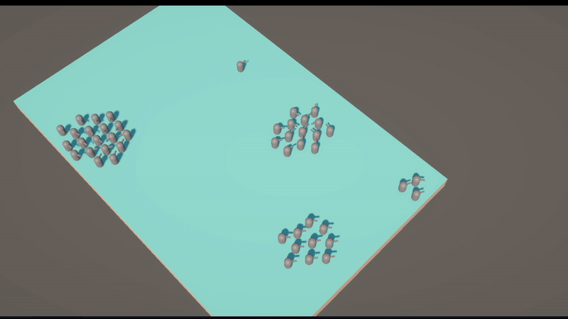
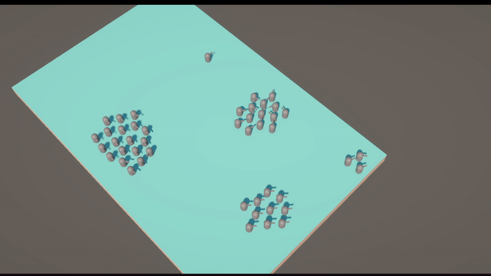
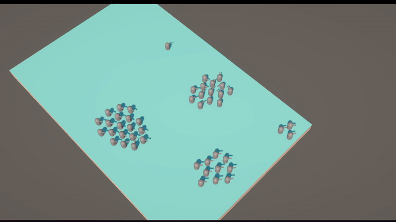

# 🧠 Prototype RTS

*A personal project for exploring and prototyping real-time strategy (RTS) mechanics in Unity.*

---

## 🕹️ About the Project

This is a **learning and experimentation project** focused on building core RTS gameplay systems — including camera controls, unit AI, selection logic, and multi-unit movement.

> ⚠️ **Note:** The project is still in development and does not yet include standalone builds. Some mechanics are incomplete or experimental.

---

## 🚀 How to Run

1. Clone this repository:
    git clone https://github.com/DeltaT71/PrototypeRTS

Open the project in Unity 2022.x or newer

Load the Main Scene (or Island Scene) located in Assets/Scenes/

Press Play in the Unity Editor

## ⚙️ Features & Mechanics
### 🎥 Camera Movement

The camera system is modular — each movement type can be toggled from the Inspector.

1. 🖱️ Scroll drag

3. 🧭 Mouse-edge scrolling

5. ⌨️ Arrow key movement
6. 🎮 WASD movement

8. 🔁 Camera rotation with Q and E

### 🧍 Unit AI

- Built on a state machine architecture for clean and flexible logic

- States include: Idle, Movement, Attack, and Chase

- Each unit is controlled by a central AI brain component

- Basic Commands: Move Attack, Chase target, Attack Enemy

### 🎯 Selection & Movement

- Supports Box Select, Shift-Select, and Single-Click selection

- Right-click to move selected units to the clicked destination

- Units move as a group, maintaining formation and stopping together

### 🧩 Lessons from RPG Playground

- Leveraged systems and design patterns developed in the previous project:

- Implemented a custom state machine

- Improved code decoupling for cleaner architecture

- Modularized systems to make components reusable

### 🔧 Possible Improvements

Replace the Singleton Selection Manager with an Event Manager to improve scalability and reduce coupling

### 🗺️ Future Features

- Add multiple unit types (e.g., workers, ranged, heavy units)

- Implement a UI system for commands and unit info

- Add animations for unit actions and movement
